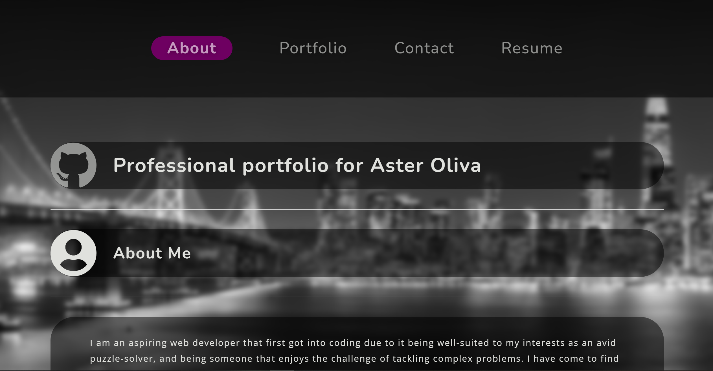

# react-portfolio

## Project Description

This is my current professional portfolio intended to showcase my work as a developer, created with React.js, built with Vite and deployed with Netlify.

## Contents

- [Introduction](#introduction)
- [Deployment](#deployment)
- [Collaborators](#collaborators)
- [Resources](#resources)
- [License](#License)

## Introduction

For this project, I set out to create an updated and current portfolio to showcase several of my projects that I am most proud of. I intend to share this portfolio with prospective employers or freelance clients, to both advertise my abilities and to provide a central location for accessing my various social media sites and GitHub repositories.

See below for a screenshot of the deployed project:

## Deployment

[Link to the GitHub repo for this project](https://github.com/Aoliva96/react-portfolio)

[Link to the deployed project on Netlify](https://aster-oliva-portfolio.netlify.app/portfolio)

## Collaborators

I worked closely with my classmate George Schultz for this project, who provided his own portfolio codebase for me to review and utilize. As a result, there will be a notable similarity between our repositories. This is especially so due to working on a tight time constraint to complete this project, which resulted in less room for me to fully modify the projects layout and content to my own preferences. I plan to continue development on this project and implement more features in the near future.

## Resources

See the links below to see some of the resources I used for this project:

[Build Settings | Netlify Docs](https://docs.netlify.com/configure-builds/overview/#build-settings)

[Git Overview | Netlify Docs](https://docs.netlify.com/git/overview/)

[Getting Started | Vite](https://vitejs.dev/guide/)

[useState | React Docs](https://react.dev/reference/react/useState)

I also referenced the edX bootcamp week 20 mini-project solution for my file structure and code syntax.

## License

This project utilizes the standard MIT License.
